# Web App Part 3 & 4

## Part 3
### A) Data in Pycharm
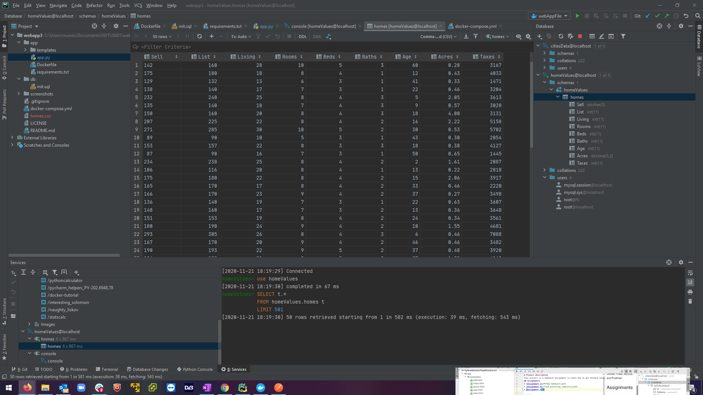

### B) Data in Web Browser
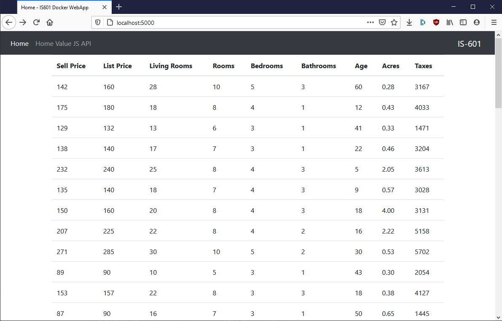

### C) Viewing Single Record

### D) New Records Added
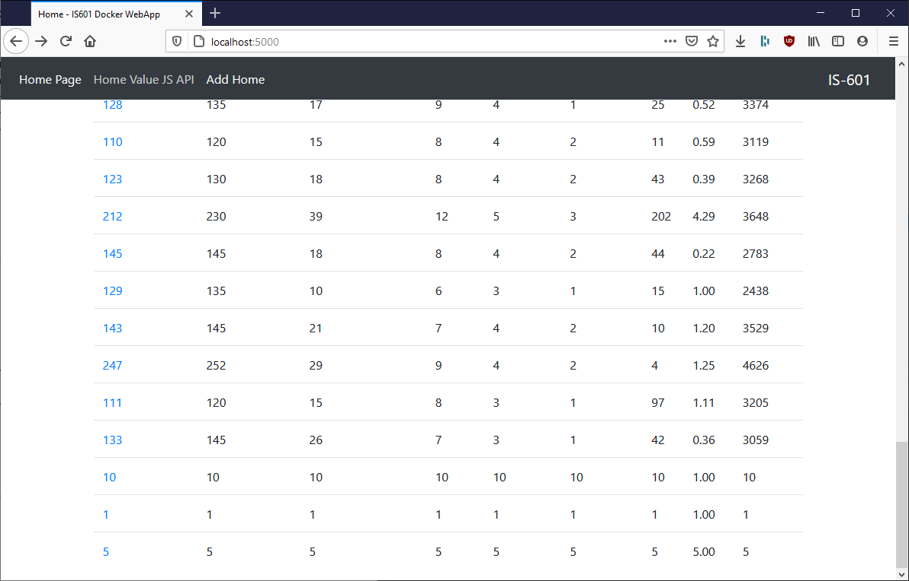

### E) Updated Records
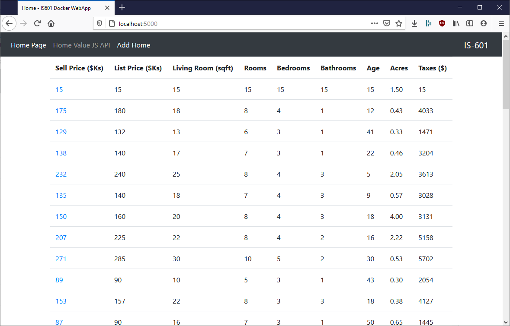

### F) Deleted Records (Sell Price 247 was deleted)
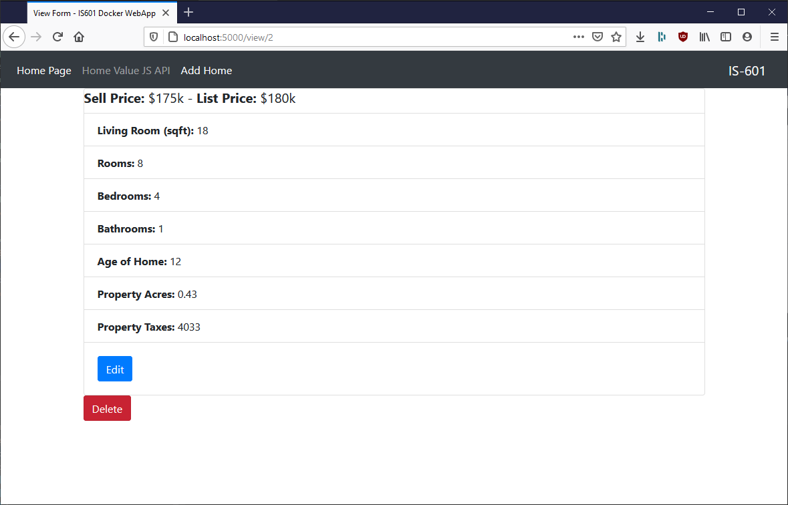

##Part 4
### A) All Data in Postman
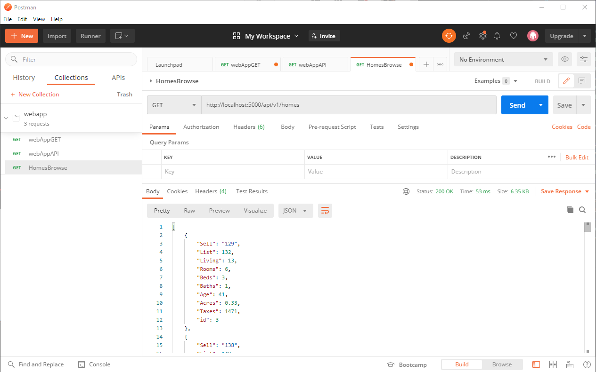

### B) Single Record in Postman
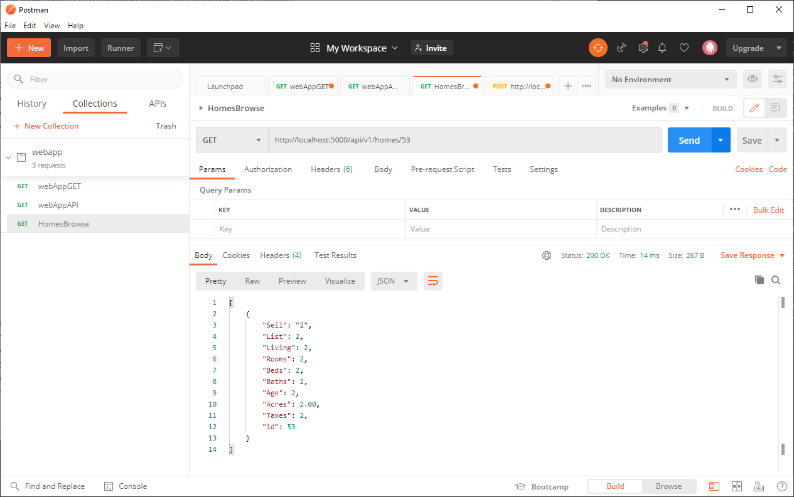

### C) New Record Added
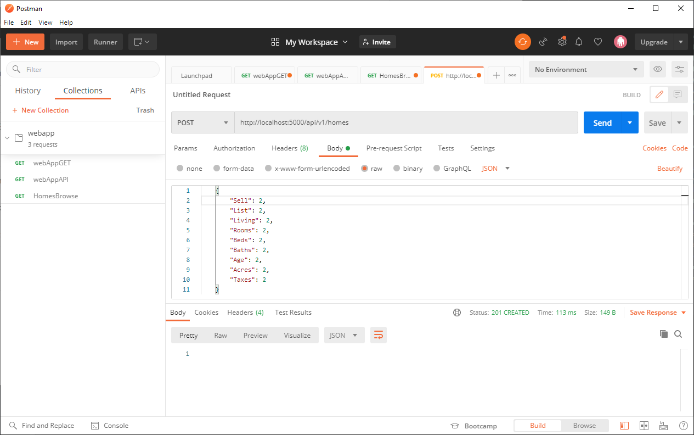
### New Record Verified
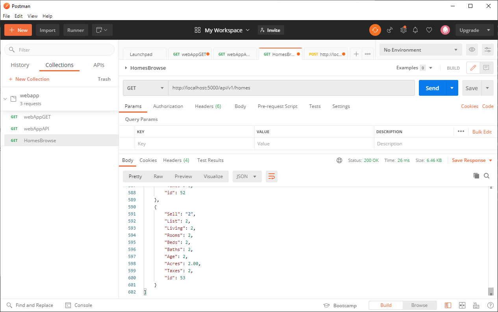

### D) Edit Record 
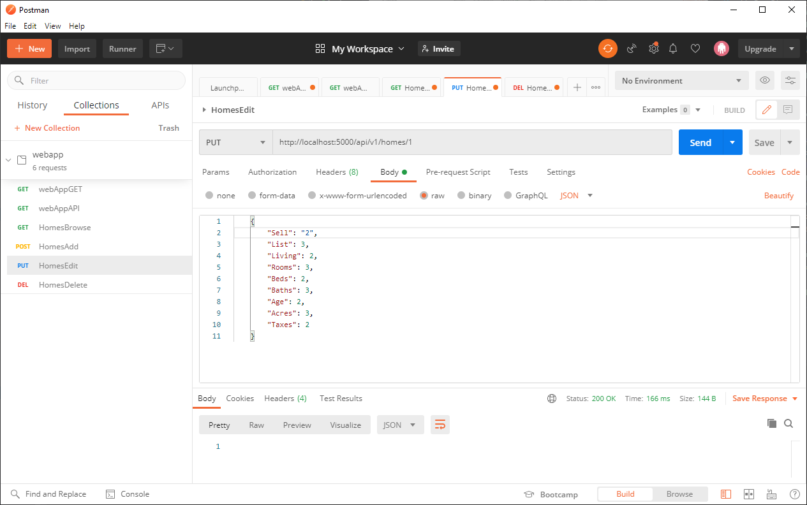
### Edit Record Verified
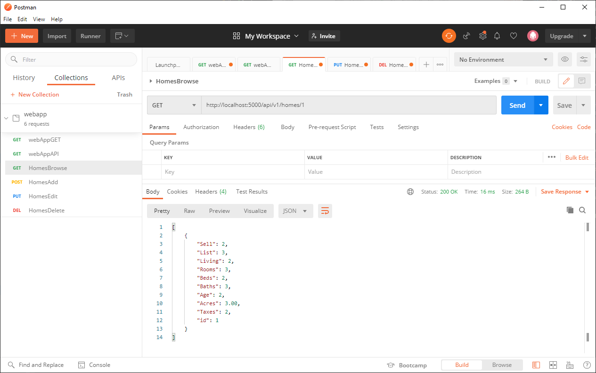

### E) Delete Record 
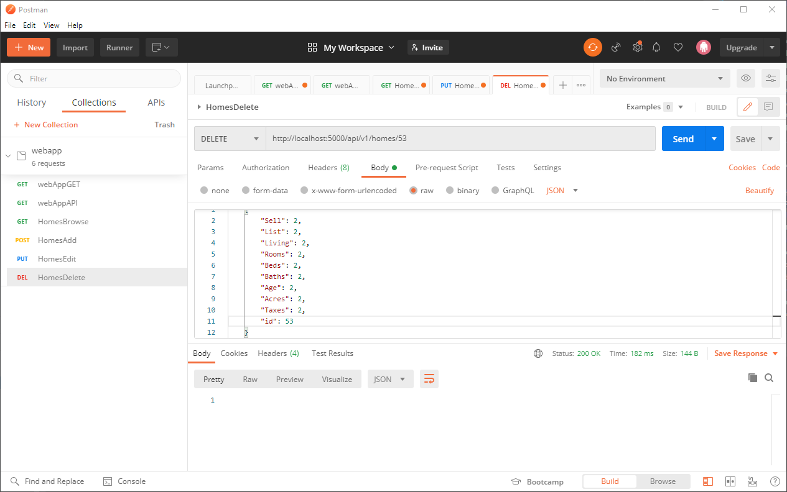
### Delete Record Verified
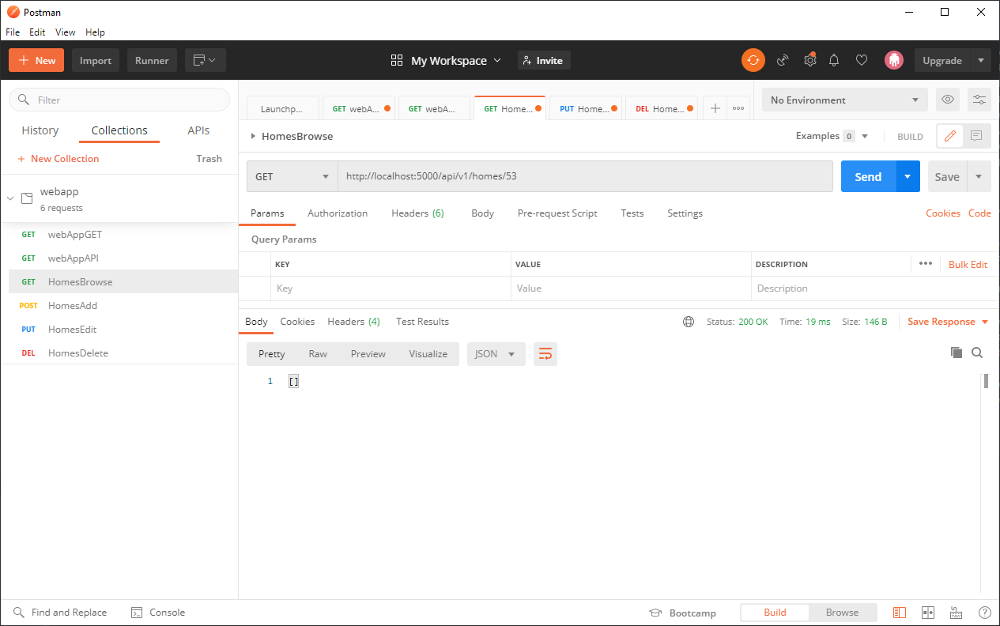

